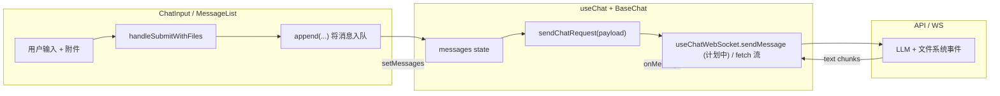
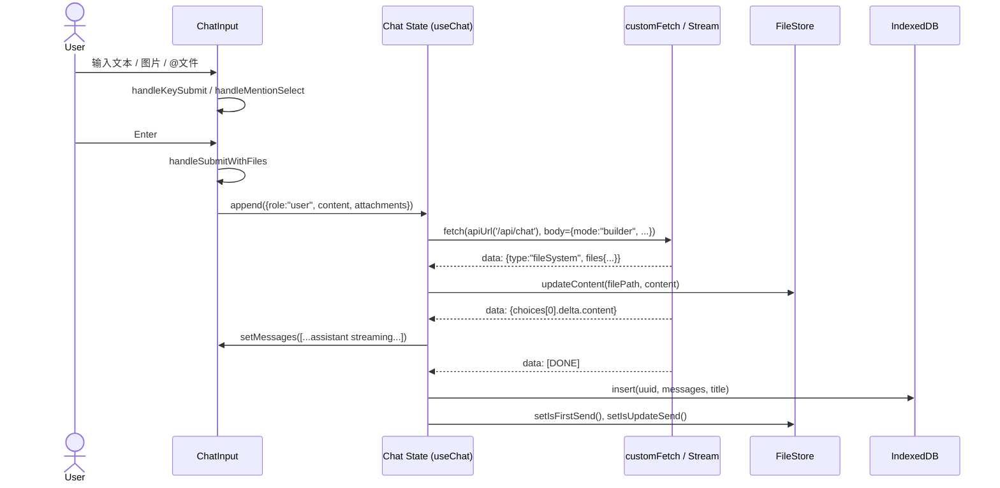

# Chat vs. Builder 模式发送链路详解

> 目标：帮助排查「编辑器模式发不出消息」一类的问题，文档梳理了从输入框到 WebSocket/流式响应的关键节点，并给出了 Builder/Chat 两种模式的差异点与参考代码。

---

## 1. 总览



- 两种模式共用一套 UI 与消息状态（`useChat`），差异主要体现在 **上下文注入** 与 **请求体 `mode` 字段**。
- Builder 模式在 `messages` 里自动注入 `<boltArtifact>`，用于把 IDE 文件快照交给模型；Chat 模式保持纯对话。

---

## 2. Builder 模式逐步剖析

### 2.1 文件上下文注入

- `convertToBoltAction()` 会把 `useFileStore` 中标记为「首次发送」与「增量」的文件，包装成 `<boltArtifact>` 片段，并在组件加载或文件变动时插入到消息列表里。
- 若用户切换历史会话，会把历史 `messages` 恢复后再补上一条 `boltArtifact`，确保助手看到当前工作目录。

```86:149:ui-react/src/components/AiChat/chat/index.tsx
function convertToBoltAction(obj: Record<string, string>): string {
    return Object.entries(obj)
        .filter(([filePath]) => !excludeFiles.includes(filePath))
        .map(
            ([filePath, content]) =>
                `<boltAction type="file" filePath="${filePath}">
${content}
</boltAction>`
        )
        .join("\n\n");
}
...
const initConvertToBoltAction = convertToBoltAction({
    ...filesInitObj,
    ...filesUpdateObj,
});
```

### 2.2 输入体验

- `ChatInput` 根据 `ChatMode` 切换 placeholder 与主题，并提供：
  - `@` 文件引用（`getFileOptions` + `handleMentionSelect`）。
  - 错误卡片一键修复（`ErrorDisplay` 调用 `handleSubmitWithFiles`）。
  - 图片/剪贴板/拖拽上传，统一透传到 `experimental_attachments`。

```373:441:ui-react/src/components/AiChat/chat/components/ChatInput/index.tsx
const handleKeyDown = (e: React.KeyboardEvent<HTMLTextAreaElement>) => {
  ...
  if (showMentionMenu) {
    if (e.key === "ArrowDown") { ... }
    ...
  } else {
    handleKeySubmit(e);
  }
};
```

### 2.3 提交 → 消息入队

1. `handleSubmitWithFiles` 会阻止空消息，并把当前选中的图片转成附件数组。
2. `append`（来自 `useChat`）把用户消息推入 `messages`；角色为 `user` 时会立即触发下一步的 `sendChatRequest`。

```793:833:ui-react/src/components/AiChat/chat/index.tsx
const handleSubmitWithFiles = async (_: React.KeyboardEvent, text?: string) => {
    if (!text && !input.trim() && uploadedImages.length === 0) return;
    const currentAttachments = uploadedImages.map((img) => ({
        id: img.id,
        name: img.id,
        type: img.file.type,
        localUrl: img.localUrl,
        contentType: img.file.type,
        url: img.url,
    }));
    clearImages();
    append({ role: "user", content: text || input }, {
        experimental_attachments: currentAttachments,
    });
    setInput("");
};
```

### 2.4 请求封装

- `sendChatRequest`（`useChat` 内部）在 Builder 模式会将 `mode` 设置为 `"builder"` 并拼接 `otherConfig.extra`。
- 当前实现仍走 `fetch` 流式接口（`customFetch` 将后端 SSE 转换为 `ai/react` 期望的文本流）；`useChatWebSocket` 已实现但尚未挂载，可作为后续替换方案。

```458:606:ui-react/src/components/AiChat/chat/index.tsx
const { messages: realMessages, input, handleInputChange, isLoading, ... } = useChat({
    api: apiUrl('/api/chat'),
    fetch: customFetch,
    streamProtocol: 'text',
    headers: { ...(token && { Authorization: `Bearer ${token}` }) },
    body: {
        model: baseModal.value,
        mode: mode,
        otherConfig: {
            ...otherConfig,
            extra: {
                ...otherConfig.extra,
                isBackEnd: otherConfig.isBackEnd,
                backendLanguage: otherConfig.backendLanguage
            },
        },
        ...(baseModal.functionCall && mcpTools.length > 0 && { tools: ... })
    },
    id: chatUuid,
    onFinish: async (message) => { ... },
});
```

### 2.5 流式响应与文件同步

- `customFetch` 读取后端返回的流，拦截 `fileSystem` 事件，并调用 `updateContent` 把远端文件写回本地存储。
- OpenAI 兼容格式会被转换成纯文本，交给 `ai/react` 自动拼接到最后一条 `assistant` 消息。
- `onFinish` 中再次解析 XML 结果（兜底同步代码），并把对话持久化进 `indexedDB`。

```361:443:ui-react/src/components/AiChat/chat/index.tsx
const stream = new ReadableStream({
    start(controller) {
        function pump(): Promise<void> {
            return reader.read().then(({ done, value }) => {
                if (done) { controller.close(); return; }
                const text = new TextDecoder().decode(value);
                const lines = text.split('\n').filter(line => line.trim());
                for (const line of lines) {
                    if (line.startsWith('data:')) {
                        const dataContent = line.slice(5).trimStart();
                        if (dataContent === '[DONE]') { ... }
                        const parsed = JSON.parse(dataContent);
                        if (parsed?.type === 'fileSystem' && parsed.data?.files) {
                            for (const [filePath, fileContent] of Object.entries(parsed.data.files)) {
                                updateContent(filePath, fileContent);
                            }
                            continue;
                        }
                        if (parsed.choices?.[0]?.delta) {
                            const content = parsed.choices[0].delta.content;
                            if (content) transformedText += content;
                        }
                    }
                }
                if (transformedText) {
                    controller.enqueue(new TextEncoder().encode(transformedText));
                }
                return pump();
            });
        }
        return pump();
    }
});
```

---

## 3. Chat（问答）模式差异

| 维度 | Builder | Chat |
| --- | --- | --- |
| `mode` 字段 | `"builder"` | `"chat"`（或 `"qa"`, 取决于 `ChatMode`） |
| 自动上下文 | 注入 `<boltArtifact>`（当前文件 + 更新文件） | 无自动注入，保持纯文本 |
| 错误修复卡片 | 启用（通过 `ErrorDisplay`） | 同组件，取决于是否有 IDE 错误 |
| 文件系统事件 | 解析并 `updateContent` | 通常无文件事件，解析逻辑仍兼容 |
| MCP 工具 | 仅当模型支持 `functionCall` 且用户启用工具才透传 | 同上 |

> **发送链路一致**：两种模式均经过 `handleSubmitWithFiles → append → useChat(customFetch)`，因此网络层排查时只需关注 `mode` 值与上下文内容是否符合预期。

---

## 4. 流程图（Builder 模式）



---

## 5. 调试建议

1. **确认模式**：`useChat` 请求体的 `mode` 是否为 `"builder"`；若不是，检查 `useChatModeStore()`。
2. **查看注入消息**：在浏览器 DevTools 中查看 `messages`，确认 `<boltArtifact>` 是否存在、内容是否符合文件内容（排除为空导致模型无法理解上下文）。
3. **网络层**：对比 `customFetch` 的日志，确认服务端是否返回流；如果需要 WebSocket，可以在 `useMessageParser.tsx` 中启用 `useChatWebSocket` 并替换 `useChat` 的 `fetch`。
4. **文件同步**：验证 `fileSystem` 事件是否触发 `updateContent`，可在 `useFileStore` 里添加日志，排查「模型改了文件但 IDE 未更新」的问题。
5. **历史缓存**：如果 Builder 模式在旧会话里异常，重置 `indexedDB` 或在 `eventEmitter` 的 `chat:select` 逻辑里验证 `loadChatHistory` 是否成功。

---

## 6. 参考文件

- `ui-react/src/components/AiChat/chat/index.tsx` — Builder/Chat 模式主逻辑、`useChat` 管道。
- `ui-react/src/components/AiChat/chat/components/ChatInput/index.tsx` — 输入框、提及、附件及错误修复行为。
- `ui-react/src/components/AiChat/useMessageParser.tsx` — 解析文件系统事件、`useChatWebSocket` 的预备实现。
- `ui-react/src/components/WeIde/stores/fileStore.ts` — 追踪 IDE 文件状态（可结合本篇流程排查同步问题）。

> **后续拓展**：若要完全切换到 WebSocket，可复用 `useChatWebSocket` 中的 `WebSocketConnectionManager`，直接在 `BaseChat` 里调用 `sendMessage`，并把 `customFetch` 的解析逻辑移动到 `onMessage`。


